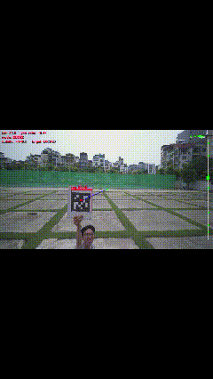

# AI-Powered Autonomous Landing Drone (Hailo + ArduPilot)

Autonomous drone system combining edge AI object detection, MAVLink flight control, and 4G-networked telemetry to achieve **fiducial-marker tracking and precision landing** — end to end, from bench test to outdoor flight.

> **What it does:** the drone flies a mission to a designated landing waypoint, holds position in `GUIDED` mode, detects a fiducial marker on the ground using an on-board AI accelerator, yaws to center the marker, then executes a controlled descent and precision landing on it.

*Demo hệ thống nhận diện và bám mục tiêu theo thời gian thực.*

.jpg)
*Phần cứng Drone ZD680 hiện tại tích hợp Raspberry Pi 5 và Hailo AI HAT.*

---

## Table of Contents

- [Overview](#overview)
- [System Architecture](#system-architecture)
- [Hardware](#hardware)
- [Software Stack](#software-stack)
- [Repository Structure](#repository-structure)
- [1. Flight Controller Setup (ArduCopter)](#1-flight-controller-setup-arducopter)
- [2. Companion Computer OS Setup](#2-companion-computer-os-setup)
- [3. Hailo AI Accelerator — Install & Model Training](#3-hailo-ai-accelerator--install--model-training)
- [4. MAVLink Routing](#4-mavlink-routing)
- [5. 4G Connectivity (Quectel EC20)](#5-4g-connectivity-quectel-ec20)
- [6. Video Streaming](#6-video-streaming)
- [7. Object Detection + Yaw Tracking (Hailo → MAVLink)](#7-object-detection--yaw-tracking-hailo--mavlink)
- [8. Precision Landing (Fiducial Marker) — Work in Progress](#8-precision-landing-fiducial-marker--work-in-progress)
- [9. Testing Progression](#9-testing-progression)
- [Troubleshooting / Lessons Learned](#troubleshooting--lessons-learned)
- [Roadmap](#roadmap)
- [License](#license)

---

## Overview

This project builds a companion-computer stack for an ArduCopter-based drone that:

1. Flies a normal GPS mission to a landing approach waypoint.
2. Switches to `GUIDED` and holds position over the target area.
3. Runs a YOLO model on a Hailo-8L AI accelerator to detect a marked target (currently a printed fiducial tag).
4. Sends yaw-rate commands over MAVLink (`SET_POSITION_TARGET_LOCAL_NED`) to keep the target centered in frame, using a PID controller on pixel offset.
5. Streams live annotated video back over a 4G link for remote monitoring.
6. (In progress) Switches to fiducial-marker pose estimation for a final precision, centered landing.

The pilot is always in the loop for actual flight — this system does not replace a licensed/experienced pilot for test flights; it augments GUIDED-mode behavior under the pilot's supervision, with manual override always available.

## System Architecture
